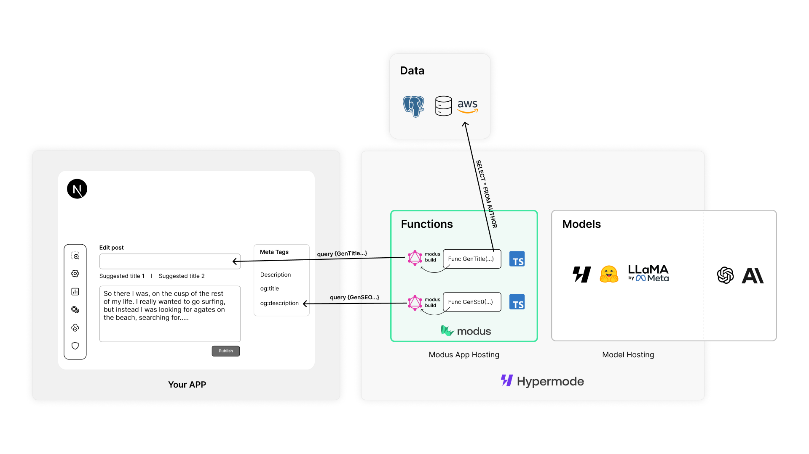
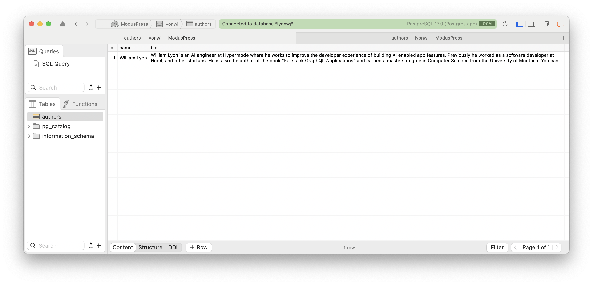
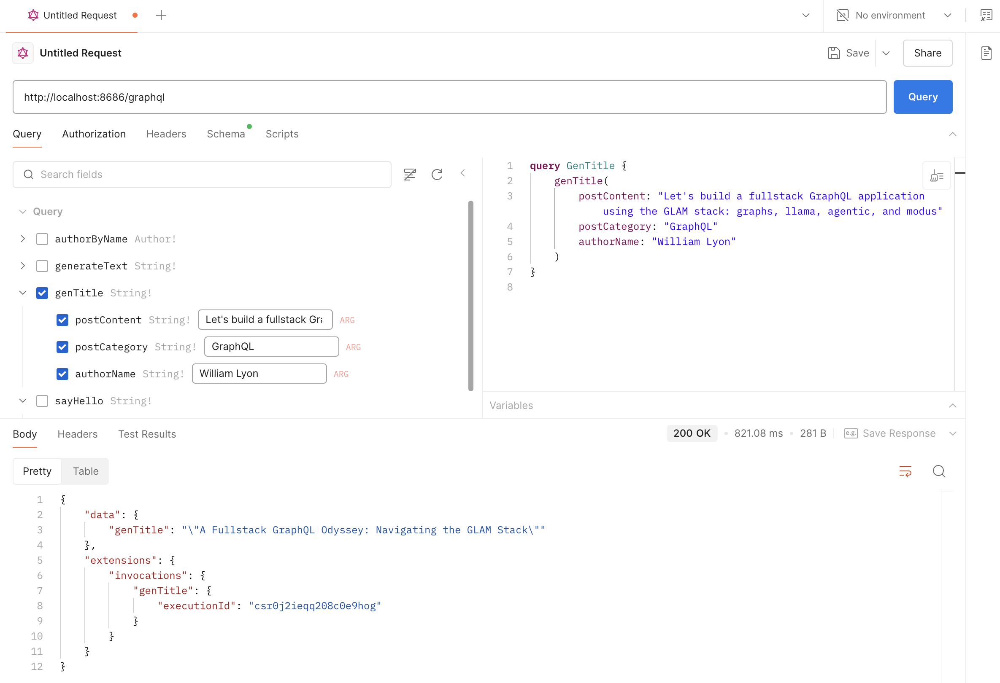

# ModusPress

This example shows how to add LLM-backed features to a fictitious web-based blog platform using [Modus](https://docs.hypermode.com/modus), the open source framework for building intelligent APIs. Specifically, this example is a Modus app that exposes a GraphQL endpoint with the

- generate suggested blog post titles based on the blog post content, in the style of the author
- generate HTML meta tags optimized for SEO based on the blog post content



## Setup

Install the Modus CLI (if not already installed):

```
npm i -g @hypermode/modus-cli
```

**Seed Postgres DB**

This example pulls author biography data from a Postgres database that represents the backend database for our blog platform. You'll need to create a Postgres database and seed it with author data using the following schema:



**Set database credentials in .env**

If using a local Postgres database with defaults your conection credentials will look something like this:

```
MODUS_MODUSPRESSDB_USERNAME=<YOUR_USERNAME_HERE>
MODUS_MODUSPRESSDB_HOST=localhost
MODUS_MODUSPRESSDB_PORT=5432
MODUS_MODUSPRESSDB_DBNAME=<YOUR_DB_NAME_HERE>
```

**Connect to Hypermode model hosting**

This example uses the LLaMa open source LLM hosted on Hypermode. You can create a free Hypermode account to leverage model hosting using the Hypermode Platform with the `hyp` cli.

Install `hyp` cli:

```
npm i -g @hypermode/hyp-cli
```

Login to Hypermode:

```
hyp login
```

This command will open a web browser and prompt you to sign in or create a free Hypermode account, then select an organization. Once complete you will be able to use Hypermode hosted models in your Modus app.

## Run

```
modus dev
```

This will build your Modus app and launch a GraphQL API at `localhost:8686/graphql`

## Query

You can query the GraphQL endpoint using any GraphQL client or cURL. Here we use Postman to query for suggested titles based on the blog post content and author bio retrived from Postres and then passed to the LLM.


